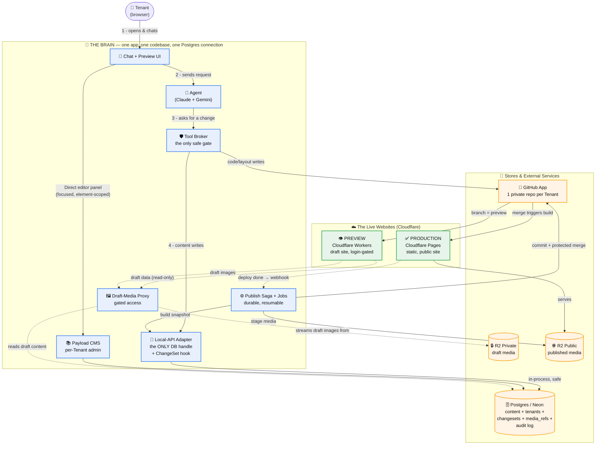
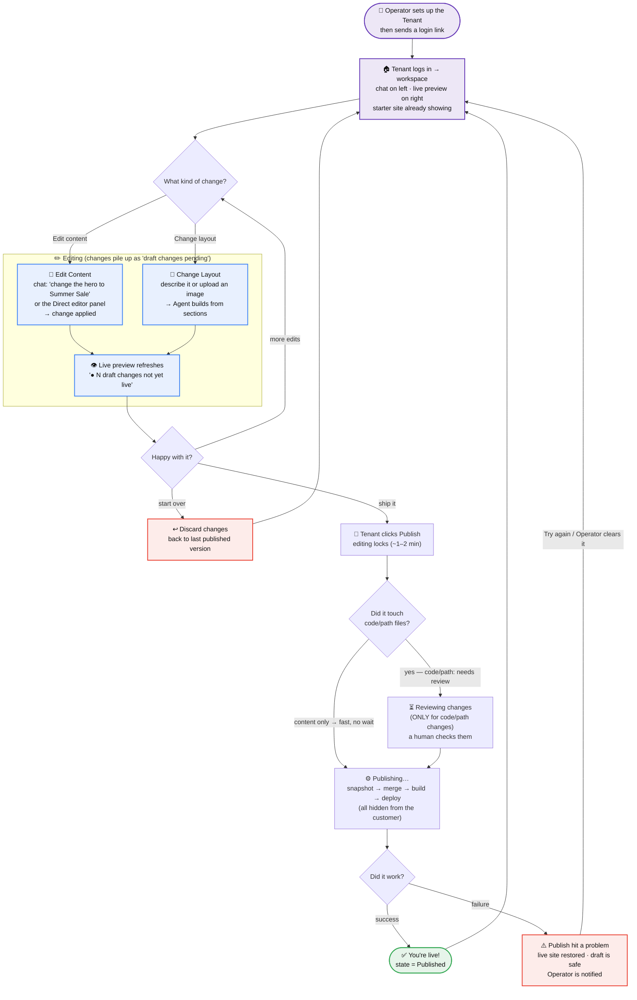

# SiteAgent v1 — Simple Diagrams

Two separate, easy-to-read diagrams in one file:
1. **Architecture** — what programs run, where, and how they talk (from `Architecture.md`).
2. **Workflow** — how a person moves through the product (from `UserFlow.md`).

Both are drawn to be readable first, exhaustive second. The detailed rules live in the source docs; these are the map.

---

# 1. Architecture — What Runs Where

The whole product is **one app** ("The Brain"). Everything inside the dashed box is a single Node/Next.js codebase sharing one database connection. Outside it are the stores and the two public website surfaces.

### How to read it (the 5 rules that matter)
- **The Agent never touches a store directly.** It can only *ask* → `Agent → Broker → Adapter → Postgres`. (Contract A)
- **One door to the database.** The Local-API Adapter is the single module that holds the DB handle, always runs with tenant rules on, and stamps every write into the active ChangeSet. A no-ChangeSet write is rejected. (Contracts A + B)
- **Drafts are private.** The Preview website can only read drafts **through the Brain's proxy** (dotted lines) — the proxy reads draft *content* from Postgres/Payload and streams draft *images* from private R2. The Worker never touches the database or storage directly. (Contract C)
- **Publishing is a safe, resumable saga.** It builds a snapshot, does a protected merge into the production branch, then a single build deploys the static site. If anything breaks, it rolls back. (Contract D)
- **Two different Cloudflare products.** Production = static Pages site (fast, public). Preview = Workers SSR (draft, login-gated). Not two modes of one thing.

---

# 2. Workflow — The Human Journey

This is what a **customer** actually experiences. All the branches, merges, and saga steps from the architecture stay **invisible** — they only ever see *edit → preview → Publish*.

### How to read it (the customer's 5 states)
- **Published** — live site and draft match; nothing pending.
- **Draft changes pending** — edits are stacking up; banner shows *"● N draft changes not yet live"* with **[Publish]** / **[Discard changes]**.
- **Reviewing changes** — appears **only** when the publish touches code/path files; a real person checks them. **Content-only publishes skip this entirely and feel fast** — straight to *Publishing…*, no human wait.
- **Publishing…** — editing is locked for ~1–2 minutes while the hidden saga runs.
- **Publishing paused** — something failed; the live site is restored, the draft is kept safe, and the Operator steps in. New edits are blocked until cleared.

### The words the customer NEVER sees
`ChangeSet · branch · merge · deploy · saga · snapshot · CODEOWNERS` — all of that lives in the architecture and the Operator's logs only. The customer just sees **edit → preview → Publish**.

---

## How the two diagrams connect
| Customer action (Workflow) | What actually happens (Architecture) |
|---|---|
| Types a chat edit, or uses the Direct editor panel | Agent/CMS → Broker → Adapter → Postgres (Contract A) |
| Sees the live preview | Preview Worker reads draft content (Postgres) + draft images (R2) through the Brain's proxy (Contract C) |
| Clicks **Publish** | Publish saga: snapshot → protected merge → build → deploy (Contract D) |
| "Reviewing changes" wait | CODEOWNERS human review on code-owned paths (Contract D) |
| **Discard changes** | Tear down ChangeSet branch + preview + GC staged media |
| "Publish hit a problem" | Saga compensation / rollback, Operator notified |
